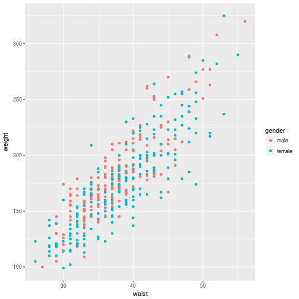

How to Learn R
========================================================
author: Cole Beck
date: July 13, 2018
autosize: true
css: myrules.css

### Why are you here?

Programming is like Sudoku
========================================================


***
- learn set of rules
- does order matter when applying rules?
- are there multiple solutions?
- practice makes perfect

Sources of Information
========================================================

## stackoverflow

https://stackoverflow.com/tags/r/info

## R clinic

1st Friday of each month

1:30pm in the Biostatistics Conference Room

11105, 2525 West End Avenue

Contact Cole at [cole.beck@vumc.org](mailto:cole.beck@vumc.org?subject=R Clinic)

Sources
========================================================

type|site|link
-----|-----|-----
forum|stackoverflow|https://stackoverflow.com/questions/tagged/r
forum|Rstudio community|https://community.rstudio.com/
course|Coursera|https://www.coursera.org/course/rprog
course|Datacamp|https://www.datacamp.com/courses/introduction-to-r
tutorial|swirl|https://github.com/swirldev/swirl_courses#swirl-courses
book|R for Data Science|http://r4ds.had.co.nz/
book|Advanced R|http://adv-r.had.co.nz/
blog|R-bloggers|http://www.r-bloggers.com/
blog|RStudio blog|https://blog.rstudio.com/

R Documentation
========================================================

### Accessing documentation from within a R session

code|result
----|----
apropos('norm')|loaded functions with name containing "norm"
help.search('norm')|any function with name or description containing "norm"
help('rnorm')|help page for "rnorm" function
?rnorm|help page for "rnorm" function
help(package = "survival")|help page for "survival" package

Building Blocks
========================================================

## Types of data

- numeric (categorical)
- character
- logical
- date (time)

## Storage of data

- vector
- matrix
- data.frame
- list
***
## Special Types

- Undefined: NULL
- Missing: NA
- Infinite: Inf, -Inf
- Not a Number: NaN

## Control Structures

- iteration: for, while, apply
- branching: if
- functions

Creating Numerical Vectors
========================================================


```r
numeric(3)
```

```
[1] 0 0 0
```

```r
rep(1, 3)
```

```
[1] 1 1 1
```

```r
c(1, 2, 3)
```

```
[1] 1 2 3
```

```r
1:3
```

```
[1] 1 2 3
```

```r
seq(3)
```

```
[1] 1 2 3
```
***

```r
seq(1, 10, by = 2)
```

```
[1] 1 3 5 7 9
```

```r
seq(1, 21, length.out = 6)
```

```
[1]  1  5  9 13 17 21
```

```r
seq_along(c(1,10,100,1000))
```

```
[1] 1 2 3 4
```

```r
sample(10, 5)
```

```
[1]  3  6  5 10  8
```

```r
sample(3, 5, replace = TRUE)
```

```
[1] 3 2 2 2 3
```

Creating Categorical Variables
========================================================

In R, categorical variables are called factors


```r
race <- factor(sample(3, 10, replace = TRUE), labels = c('white','black','other'))
race
```

```
 [1] white white white white black other white black other other
Levels: white black other
```

```r
unclass(race)
```

```
 [1] 1 1 1 1 2 3 1 2 3 3
attr(,"levels")
[1] "white" "black" "other"
```

```r
factor(sample(c('light','moderate','vigorous'), 10, replace = TRUE), ordered = TRUE)
```

```
 [1] moderate light    vigorous vigorous light    vigorous moderate
 [8] moderate moderate moderate
Levels: light < moderate < vigorous
```

data.frame
========================================================

Typically you will create a data.frame by importing a CSV file from Excel. It is also easy to create your own.


```r
df <- data.frame(
  id = sample(3, 10, replace = TRUE),
  date = as.Date(sample(365, 10), origin = "2017-01-01"),
  value = runif(10, max = 100)
)
df
```

```
   id       date     value
1   3 2017-09-14 75.005901
2   2 2017-10-26 36.314735
3   1 2017-04-06 80.341398
4   1 2017-02-03 17.171802
5   2 2017-08-28  2.338486
6   2 2017-09-23 73.365255
7   3 2017-02-28  2.440719
8   2 2017-08-12 86.031041
9   2 2017-03-20 28.278924
10  3 2017-08-07 71.404525
```

data.frame Examples
========================================================


```r
table(df[,'id'])
```

```

1 2 3 
2 5 3 
```

```r
sorteddf <- df[with(df, order(id, date)),]
sorteddf[1:5,]
```

```
  id       date     value
4  1 2017-02-03 17.171802
3  1 2017-04-06 80.341398
9  2 2017-03-20 28.278924
8  2 2017-08-12 86.031041
5  2 2017-08-28  2.338486
```

data.frame Examples
========================================================

Subset data by condition


```r
df[df[,'value'] > 75,]
```

```
  id       date    value
1  3 2017-09-14 75.00590
3  1 2017-04-06 80.34140
8  2 2017-08-12 86.03104
```

```r
sorteddf[!duplicated(sorteddf[,'id']),]
```

```
  id       date     value
4  1 2017-02-03 17.171802
9  2 2017-03-20 28.278924
7  3 2017-02-28  2.440719
```

data.frame Examples
========================================================


```r
tapply(df[,'date'], df[,'id'], min)
```

```
    1     2     3 
17200 17245 17225 
```

```r
as.Date(tapply(df[,'date'], df[,'id'], min), origin = '1970-01-01')
```

```
           1            2            3 
"2017-02-03" "2017-03-20" "2017-02-28" 
```

```r
tapply(df[,'value'], df[,'id'], mean)
```

```
       1        2        3 
48.75660 45.26569 49.61705 
```

data.frame Examples
========================================================


```r
c1 <- tapply(df[,'date'], df[,'id'], min)
c2 <- as.Date(tapply(df[,'date'], df[,'id'], min), origin = '1970-01-01')
c3 <- tapply(df[,'value'], df[,'id'], mean)
cbind(c1, c2, c3)
```

```
     c1    c2       c3
1 17200 17200 48.75660
2 17245 17245 45.26569
3 17225 17225 49.61705
```

```r
data.frame(mindateint = c1, mindate = c2, meanval = c3)
```

```
  mindateint    mindate  meanval
1      17200 2017-02-03 48.75660
2      17245 2017-03-20 45.26569
3      17225 2017-02-28 49.61705
```

Descriptive Statistics with Hmisc
========================================================


```r
Hmisc::getHdata(diabetes)
Hmisc::describe(diabetes[,c('chol','gender')])
```

```
diabetes[, c("chol", "gender")] 

 2  Variables      403  Observations
---------------------------------------------------------------------------
chol : Total Cholesterol 
       n  missing distinct     Info     Mean      Gmd      .05      .10 
     402        1      154        1    207.8    48.22    145.0    158.0 
     .25      .50      .75      .90      .95 
   179.0    204.0    230.0    264.8    291.8 

lowest :  78 115 118 122 128, highest: 337 342 347 404 443
---------------------------------------------------------------------------
gender 
       n  missing distinct 
     403        0        2 
                        
Value        male female
Frequency     169    234
Proportion  0.419  0.581
---------------------------------------------------------------------------
```

Scatterplot
========================================================


```r
ggplot2::qplot(waist, weight, data = diabetes, color = gender)
```



Running a Model with Predictions
========================================================


```r
m <- lm(waist ~ weight + gender, data=diabetes)
coef(summary(m))
```

```
               Estimate  Std. Error   t value      Pr(>|t|)
(Intercept)  15.4056566 0.705320915 21.842053  4.958197e-70
weight        0.1220494 0.003665147 33.300012 5.448082e-117
genderfemale  1.4057294 0.299668903  4.690942  3.747412e-06
```

```r
predict(m, data.frame(weight=seq(150, 250, by=20), gender = 'male'))
```

```
       1        2        3        4        5        6 
33.71307 36.15406 38.59505 41.03604 43.47702 45.91801 
```

Writing a Function
========================================================


```r
rolldice <- function(n = 1, sides = 6) {
  sum(sample(sides, n, replace = TRUE))
}
rolldice(2)
```

```
[1] 6
```

```r
mean(replicate(1000, rolldice(sides = 100)))
```

```
[1] 49.85
```

Find Practice Problems
========================================================

- https://www.r-exercises.com/
- https://projecteuler.net/archives
- https://www.kaggle.com/competitions
- https://fivethirtyeight.com/tag/the-riddler/

```
You play a game with four balls: One ball is red, one is blue, one is green and one is yellow. They are placed in a box. You draw a ball out of the box at random and note its color. Without replacing the first ball, you draw a second ball and then paint it to match the color of the first. Replace both balls, and repeat the process. The game ends when all four balls have become the same color. What is the expected number of turns to finish the game?
```

Answer
========================================================


```r
draw <- function(box) {
  x <- sample(box)
  x[2] <- x[1]
  x
}
play <- function(colors = c('red','blue','green','yellow')) {
  cnt <- 0
  while(length(unique(colors)) > 1) {
    colors <- draw(colors)
    cnt <- cnt + 1
  }
  cnt
}
mean(replicate(1000, play()))
```

```
[1] 8.964
```
