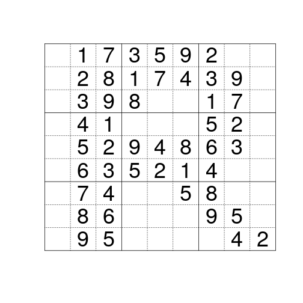

How to Learn R
========================================================
author: Cole Beck
date: October 15, 2018
autosize: true
css: myrules.css

### Why are you here?

Programming is like Sudoku
========================================================


***
- learn set of rules
- does order matter when applying rules?
- are there multiple solutions?
- practice makes perfect

Sources of Information
========================================================

## stackoverflow

https://stackoverflow.com/tags/r/info

## R clinic

1st Friday of each month

1:30pm in the Biostatistics Conference Room

11105, 2525 West End Avenue

Contact Cole at [cole.beck@vumc.org](mailto:cole.beck@vumc.org?subject=R Clinic)

Sources
========================================================

type|site|link
-----|-----|-----
forum|stackoverflow|https://stackoverflow.com/questions/tagged/r
forum|Rstudio community|https://community.rstudio.com/
course|Coursera|https://www.coursera.org/course/rprog
course|Datacamp|https://www.datacamp.com/courses/introduction-to-r
tutorial|swirl|https://github.com/swirldev/swirl_courses#swirl-courses
book|R for Data Science|http://r4ds.had.co.nz/
book|Advanced R|http://adv-r.had.co.nz/
blog|R-bloggers|http://www.r-bloggers.com/
blog|RStudio blog|https://blog.rstudio.com/

R Documentation
========================================================

### Accessing documentation from within a R session

code|result
----|----
apropos('norm')|loaded functions with name containing "norm"
help.search('norm')|any function with name or description containing "norm"
help('rnorm')|help page for "rnorm" function
?rnorm|help page for "rnorm" function
help(package = "survival")|help page for "survival" package
example(qbirthday)|run examples for "qbirthday" function

R Packages
========================================================

An R package is a collection of code to perform some task.

### Terms to know

- CRAN (install.packages)
- GitHub (devtools::install_github)
- binary (ready for use on given OS)
- source (must compile C/Fortran code)

### Find packages by task

https://cran.r-project.org/web/views/

Building Blocks
========================================================

## Types of data

- numeric (categorical)
- character
- logical
- date (time)

## Storage of data

- vector
- matrix
- data.frame
- list
***
## Special Types

- Undefined: NULL
- Missing: NA
- Infinite: Inf, -Inf
- Not a Number: NaN

## Control Structures

- iteration: for, while, apply
- branching: if
- functions

Creating Numerical Vectors
========================================================


```r
numeric(3)
```

```
[1] 0 0 0
```

```r
rep(1, 3)
```

```
[1] 1 1 1
```

```r
c(1, 2, 3)
```

```
[1] 1 2 3
```

```r
1:3
```

```
[1] 1 2 3
```

```r
seq(3)
```

```
[1] 1 2 3
```
***

```r
seq(1, 10, by = 2)
```

```
[1] 1 3 5 7 9
```

```r
seq(1, 21, length.out = 6)
```

```
[1]  1  5  9 13 17 21
```

```r
seq_along(c(1,10,100,1000))
```

```
[1] 1 2 3 4
```

```r
sample(10, 5)
```

```
[1] 6 3 5 4 9
```

```r
sample(3, 5, replace = TRUE)
```

```
[1] 3 1 1 2 3
```

Creating Categorical Variables
========================================================

In R, categorical variables are called factors


```r
race <- factor(sample(3, 10, replace = TRUE), labels = c('white','black','other'))
race
```

```
 [1] white black other other white black other black black white
Levels: white black other
```

```r
unclass(race)
```

```
 [1] 1 2 3 3 1 2 3 2 2 1
attr(,"levels")
[1] "white" "black" "other"
```

```r
factor(sample(c('light','moderate','vigorous'), 10, replace = TRUE), ordered = TRUE)
```

```
 [1] moderate vigorous light    light    light    vigorous vigorous
 [8] light    light    vigorous
Levels: light < moderate < vigorous
```

data.frame
========================================================

Typically you will create a data.frame by importing a CSV file from Excel. It is also easy to create your own.


```r
df <- data.frame(
  id = sample(3, 10, replace = TRUE),
  date = as.Date(sample(365, 10), origin = "2017-01-01"),
  value = runif(10, max = 100)
)
df
```

```
   id       date    value
1   3 2017-01-06 14.64126
2   2 2017-01-19 57.78862
3   2 2017-02-02 98.78467
4   2 2017-05-04 65.47159
5   3 2017-05-01 19.30747
6   3 2017-05-03 62.08700
7   3 2017-06-05 88.77922
8   1 2017-03-07 43.47971
9   2 2017-10-23 47.74018
10  1 2017-03-23 24.93960
```

Reading in data
========================================================

Delimited text files can be read into R, either saved locally or downloaded from a web page.


```r
url <- "https://extranet.who.int/tme/generateCSV.asp?ds=notifications"
tb <- read.csv(url)
```

Packages are available to save or load data formatted for other applications.

- databases (MySQL)
- other statistical programs (SAS, Stata)
- HTML
- REDCap API

Reading in data
========================================================

The `rio` package has a helpful listing of packages to use for data import and export.

For instance, `haven` can work with data from SAS, SPSS, and Stata.

See https://github.com/leeper/rio

***


data.frame Examples
========================================================


```r
table(df[,'id'])
```

```

1 2 3 
2 4 4 
```

```r
sorteddf <- df[with(df, order(id, date)),]
sorteddf[1:5,]
```

```
   id       date    value
8   1 2017-03-07 43.47971
10  1 2017-03-23 24.93960
2   2 2017-01-19 57.78862
3   2 2017-02-02 98.78467
4   2 2017-05-04 65.47159
```

data.frame Examples
========================================================

Subset data by condition


```r
df[df[,'value'] > 75,]
```

```
  id       date    value
3  2 2017-02-02 98.78467
7  3 2017-06-05 88.77922
```

```r
sorteddf[!duplicated(sorteddf[,'id']),]
```

```
  id       date    value
8  1 2017-03-07 43.47971
2  2 2017-01-19 57.78862
1  3 2017-01-06 14.64126
```

data.frame Examples
========================================================


```r
tapply(df[,'date'], df[,'id'], min)
```

```
    1     2     3 
17232 17185 17172 
```

```r
as.Date(tapply(df[,'date'], df[,'id'], min), origin = '1970-01-01')
```

```
           1            2            3 
"2017-03-07" "2017-01-19" "2017-01-06" 
```

```r
tapply(df[,'value'], df[,'id'], mean)
```

```
       1        2        3 
34.20965 67.44627 46.20374 
```

data.frame Examples
========================================================


```r
c1 <- tapply(df[,'date'], df[,'id'], min)
c2 <- as.Date(tapply(df[,'date'], df[,'id'], min), origin = '1970-01-01')
c3 <- tapply(df[,'value'], df[,'id'], mean)
cbind(c1, c2, c3)
```

```
     c1    c2       c3
1 17232 17232 34.20965
2 17185 17185 67.44627
3 17172 17172 46.20374
```

```r
data.frame(mindateint = c1, mindate = c2, meanval = c3)
```

```
  mindateint    mindate  meanval
1      17232 2017-03-07 34.20965
2      17185 2017-01-19 67.44627
3      17172 2017-01-06 46.20374
```

Descriptive Statistics with Hmisc
========================================================


```r
Hmisc::getHdata(diabetes)
Hmisc::describe(diabetes[,c('chol','gender')])
```

```
diabetes[, c("chol", "gender")] 

 2  Variables      403  Observations
---------------------------------------------------------------------------
chol : Total Cholesterol 
       n  missing distinct     Info     Mean      Gmd      .05      .10 
     402        1      154        1    207.8    48.22    145.0    158.0 
     .25      .50      .75      .90      .95 
   179.0    204.0    230.0    264.8    291.8 

lowest :  78 115 118 122 128, highest: 337 342 347 404 443
---------------------------------------------------------------------------
gender 
       n  missing distinct 
     403        0        2 
                        
Value        male female
Frequency     169    234
Proportion  0.419  0.581
---------------------------------------------------------------------------
```

Scatterplot
========================================================


```r
ggplot2::qplot(waist, weight, data = diabetes, color = gender)
```


Running a Model with Predictions
========================================================


```r
m <- lm(waist ~ weight + gender, data=diabetes)
coef(summary(m))
```

```
               Estimate  Std. Error   t value      Pr(>|t|)
(Intercept)  15.4056566 0.705320915 21.842053  4.958197e-70
weight        0.1220494 0.003665147 33.300012 5.448082e-117
genderfemale  1.4057294 0.299668903  4.690942  3.747412e-06
```

```r
predict(m, data.frame(weight=seq(150, 250, by=20), gender = 'male'))
```

```
       1        2        3        4        5        6 
33.71307 36.15406 38.59505 41.03604 43.47702 45.91801 
```

Writing a Function
========================================================


```r
rolldice <- function(n = 1, sides = 6) {
  sum(sample(sides, n, replace = TRUE))
}
rolldice(2)
```

```
[1] 9
```

```r
mean(replicate(1000, rolldice(sides = 100)))
```

```
[1] 50.419
```

Finding Text
========================================================


```r
grepl('eight', names(diabetes))
```

```
 [1] FALSE FALSE FALSE FALSE FALSE FALSE FALSE FALSE FALSE  TRUE  TRUE
[12] FALSE FALSE FALSE FALSE FALSE FALSE FALSE FALSE
```

```r
grep('eight', names(diabetes))
```

```
[1] 10 11
```

```r
grep('eight', names(diabetes), value = TRUE)
```

```
[1] "height" "weight"
```

```r
diabetes[1:3,grep('eight', names(diabetes))]
```

```
  height weight
1     62    121
2     64    218
3     61    256
```

Creating Output
========================================================

### Terms to know

term|description|do you care?
----|----|----
RStudio|IDE, environment for developing R code|yes
LaTeX|typesetting language|no
Rnw|mix of R code with LaTeX|no
md|lightweight markup language|yes
Rmd|mix of R code with markdown|yes
knitr|R package that dynamically converts R chunks into structured text|yes
pandoc|converts document format|no
shiny|R code execution through web page|maybe

Output Format
========================================================

- text files (CSV)
- images (PNG, JPEG)
- HTML
- PDF

Find Practice Problems
========================================================

- https://www.r-exercises.com/
- https://projecteuler.net/archives
- https://www.kaggle.com/competitions
- https://fivethirtyeight.com/tag/the-riddler/
